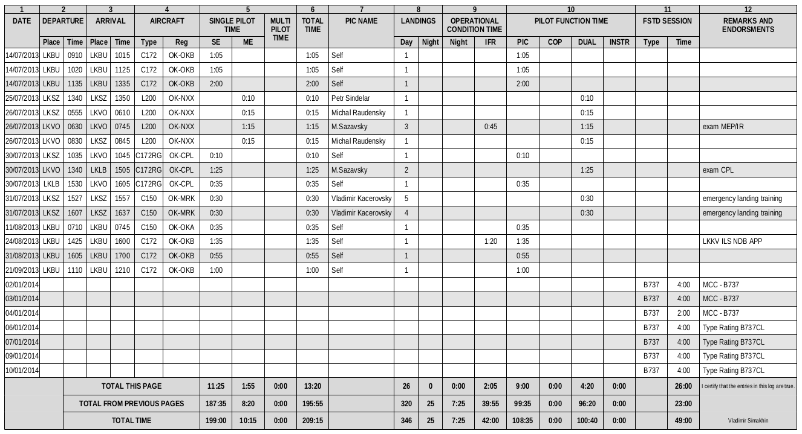
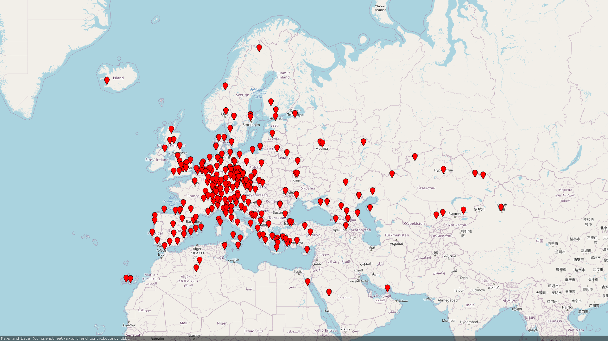
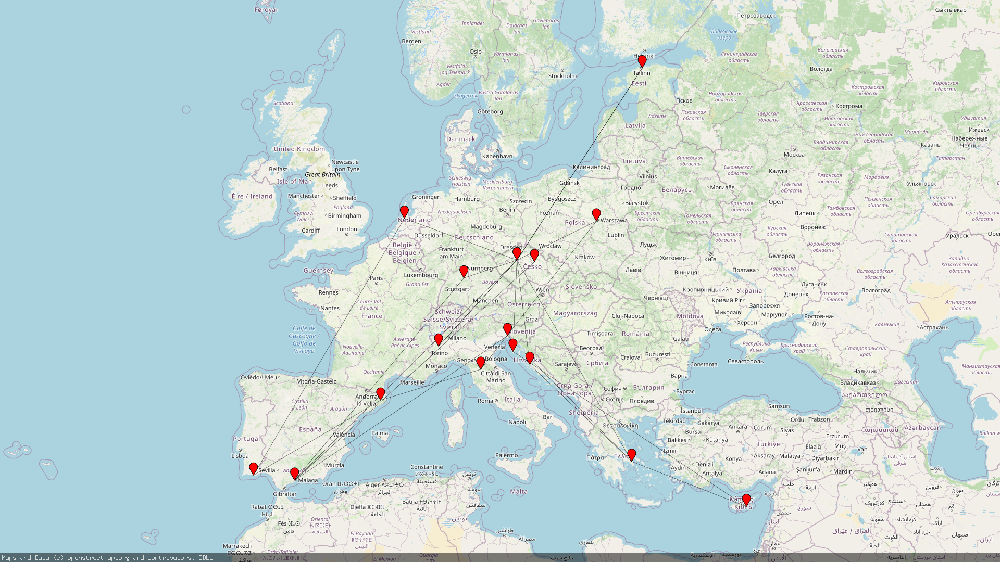

# Logbook CLI

This is a command line tool for mainly exporting logbook records from Google Spreadsheet to PDF file in EASA format.
It also supports rendering a map with a visited airports and routes.

# Setting up

## Google Spreadsheet Logbook

Currently the tool supports only one format of the [Logbook](https://docs.google.com/spreadsheets/d/1ZqNpk38vEOGABPplNj8YkRbDRqQAJNjPbj4e_1uNXkg/edit?usp=sharing), which you will need to copy to your google account (File -> Make a copy) and share as a read-only (Anyone on the internet with this link can view).

The spreadsheet supports some total calculations, but you can remove these lines. The main important lines are started from #13

You can add your flights in the `reverse` (the most recent flight is in the top) or `straight` (the most recent flight is at the end) modes

## Google API key

You will need to create an API key to allow the tool to fetch the data from the spreadsheet. The manual is here https://support.google.com/googleapi/answer/6158862?hl=en

## First run

1. Download the latest version from the [releases](https://github.com/vsimakhin/logbook/releases)
2. During the first run there will be created a config file ($HOME/.logbook.json)

```json
{
  "api_key": "",
  "owner": "Loogbook Owner",
  "page_brakes": "",
  "reverse": "true",
  "spreadsheet_id": "",
  "start_row": 20
}
```

3. Open the file with a text editor and update the parameters
- `api_key` - the API key
- `owner` - your Name, which will be written in the logbook footer
- `page_brakes` - in case you'd like to divide the logbook to several ones add the page numbers. For example, for every 50 pages `"page_brakes": "50,50,50"`
- `reverse` - should be `"true"` or "`false`", depends how you add records to the spreadsheet
- `spreadsheet_id` - ID of your copied spreadsheet. You can see it in the browser URL: `https://docs.google.com/spreadsheets/d/SPREADSHEET_ID/edit?usp=sharing`
- `start_row` - the first row in the spreadsheet with a flight data. In the example spreadsheet it's a #16

4. You can test the tool simply running it from the command line: `./logbook export`. You should see a meesage like `Loogbook has been exported to logbook.pdf` and the pdf file in the directory

# Supported commands

## Export

```sh
./logbook export
```

It will download the data from the google spreadsheet and create a PDF file logbook in EASA format



## Render map

In case you'd like to create a map with a visited airports and flown routes you can use the command `./logbook render-map`

```sh
Renders map with visited airports

Usage:
  logbook render-map [flags]

Flags:
  -d, --filter-date DATE   Set filter for the DATE logbook field for map rendering
  -h, --help               help for render-map
      --no-routes          Skip rendering routes on the map
```

### Examples

Create a map with visited airports for the all records

`./logbook render-map --no-routes`



Create a map with flights for the October 2021

`./logbook render-map --filter-date "10/2021"`



# TODO
- add show-stats command with total times and some other numbers
- add goreleaser
